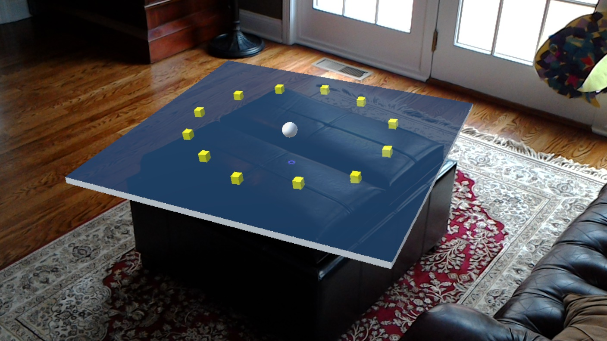

# Holo-Roll-a-Ball
Holo-Roll-a-Ball is a HoloLens version of the starter tutorial for Unity with adapted features. This is a work in progress. The latest version was built in Unity 5.5.0b6 (Preview).

## Adapted Features
* Playing board floats in front of the user when the game starts
* Move the board with your gaze and tap to lock in place
* Move the player ball with an Xbox One S Bluetooth controller, or the WASD / arrow keys on a Bluetooth keyboard
* Pick-up yellow cubes around the game board to score points, without falling off the board. If the ball falls off, it'll drop to the physical floor where the board is placed
* Show a basic UI for scoring & end of game
* Say the voice command "Reset Game" out loud to reset the player ball to the center of the board
* Show or hide the spatial mesh of your environment with the "display mesh" and "hide mesh" voice commands
* Ambient spatial sound during the game

**NOTE**: I deliberately did NOT add walls to make the game more challenging.

## UI Notes
The current UI implementation follows the basic Unity UI created in the Roll-a-Ball tutorial from Unity. It's basic for standard games, but [doesn't work by default in VR and Mixed Reality projects](https://unity3d.com/learn/tutorials/topics/virtual-reality/user-interfaces-vr). I set the UI Canvas Render Mode to **Main Camera (Camera)** which works in VR & HoloLens, but again isn't ideal. My next goal is to add a better Spatial UI in a future version.

## Controller Notes
Given that this is a HoloLens version, it is not really meant to be played with a keyboard (but you can). The ideal way to play this game is using a game controller. The new [Xbox One S controller](http://amzn.to/2bdIbNM) can actually be paired via Bluetooth to a HoloLens, and the HoloLens supports Bluetooth gamepads as HID devices. Unfortunately UWP Unity was only connecting to joysticks (with UsagePage 0x01 and Usage 0x04 as per 'Special purpose hardware ID' table, [see this link for more info](https://msdn.microsoft.com/en-us/library/windows/hardware/ff538842(v=vs.85).aspx)), but devices like the Xbox One S controller are classified as gamepads - (UsagePage 0x01 and Usage 0x05). Unity has fixed the problem in their main branch, and will graft the fixes to upcoming Unity 5.3 and 5.4. The fix has landed in 5.3 and is in queue for 5.4. HoloLens is pulling from 5.4 line so this will propagate into the next release which happens after this lands in 5.4. [See this forum thread for more info](http://forum.unity3d.com/threads/has-anyone-gotten-a-controller-to-work-on-hololens-unity-yet.414122/#post-2737242).

As of Unity 5.5.0b6, this issue is still not resolved, so I decided to use the [Xbox Controller Input for HoloLens plugin](https://www.assetstore.unity3d.com/en/#!/content/70068) from the Asset Store, which enables a HoloLens application to make use of all controls on a paired Xbox One S Wireless controller. I will eventually go back to the Unity Input Manager once the input bugs are fixed.

**TL;DR:** I was initially forced to play the initial version of Holo-Roll-a-Ball with a Bluetooth keyboard due to Unity-HTP issues, but I added support for the Xbox One S controller via a plugin. I will eventually remove the plugin and upgrade to the full Input Manager in Unity to support all Bluetooth controllers for a better experience.

## Follow Me
* Twitter: [@ActiveNick](http://twitter.com/ActiveNick)
* Blog: [AgeofMobility.com](http://AgeofMobility.com)
* SlideShare: [http://www.slideshare.net/ActiveNick](http://www.slideshare.net/ActiveNick)
